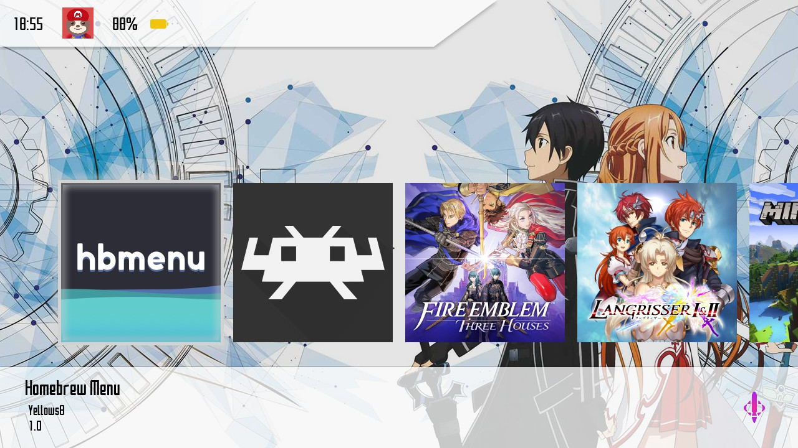
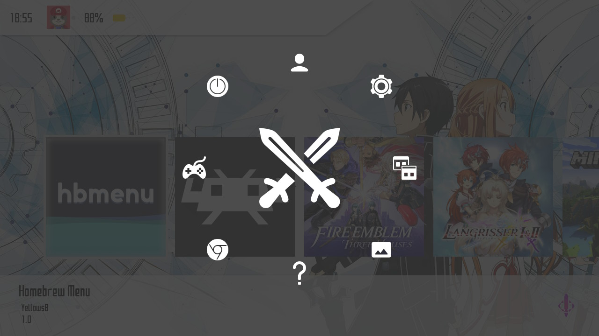
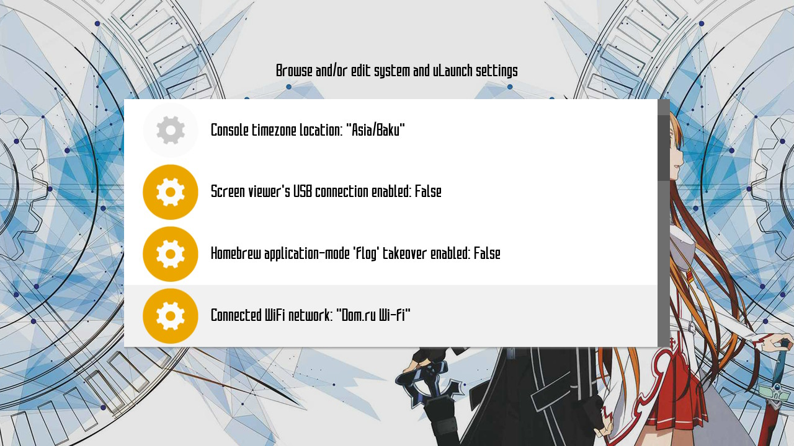
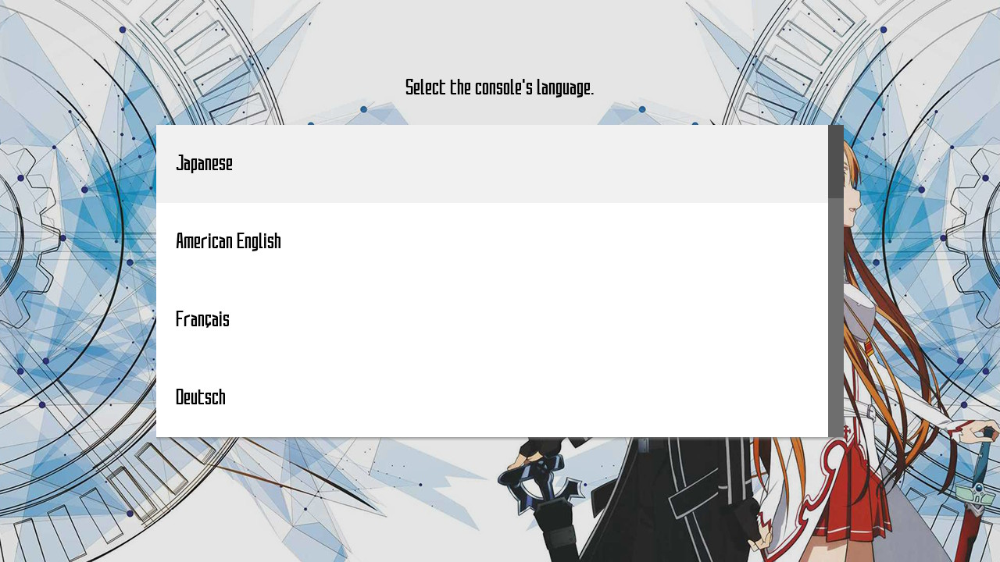
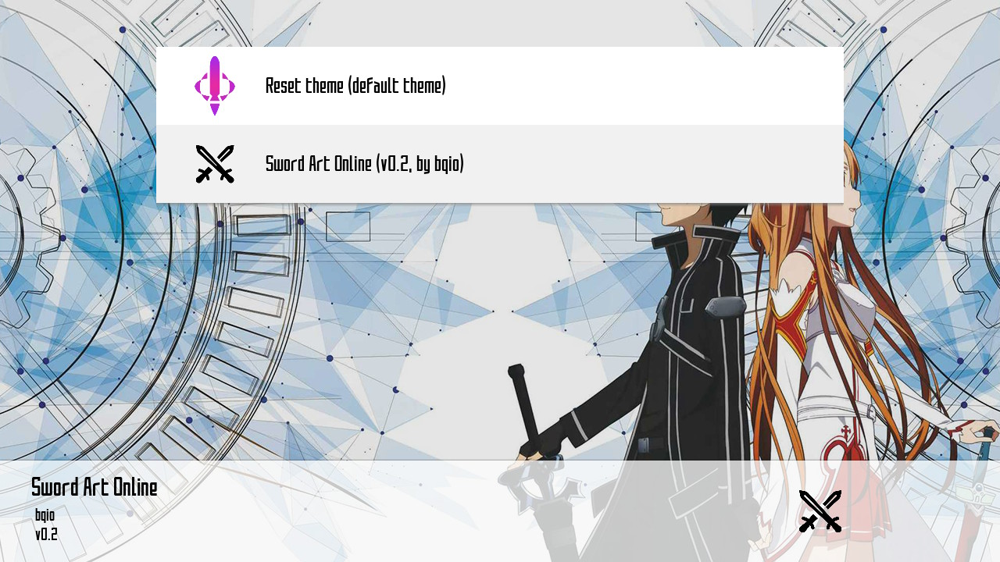

  

<h1 align="center">Sword Art Online [uLaunch]</h1>

  <a href="https://github.com/bqio/ulaunch-sao/releases">

# Thanks
* icons by <a target="_blank" href="https://icons8.com">Icons8</a>
* created using [uLaunch Theme Generator](https://bqio.ru/ulaunch-theme-generator)

# Screenshots

## Main menu

## Quick menu

## Settings menu

## Languages menu

## Themes menu

